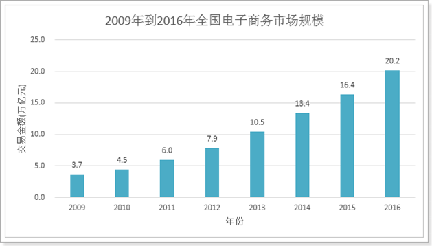
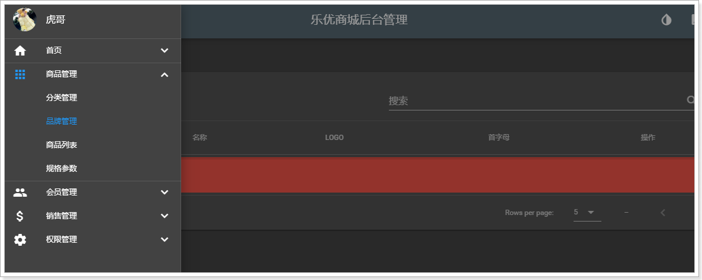
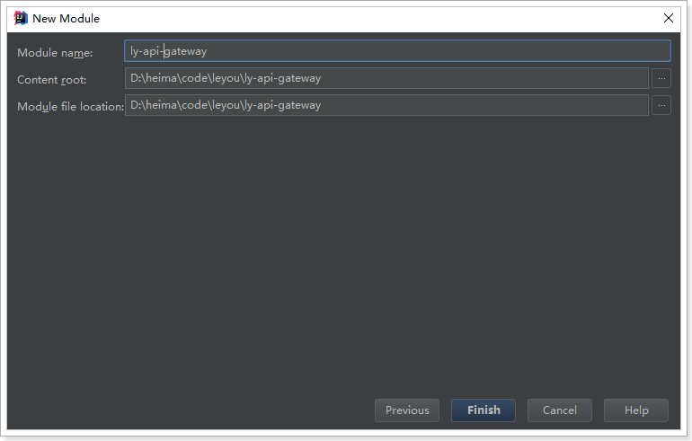
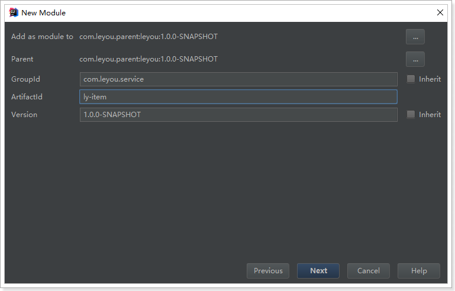
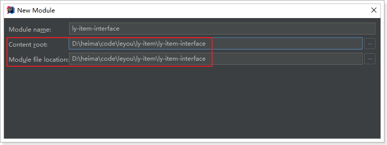
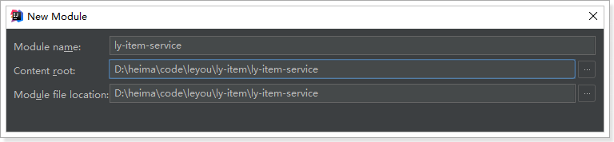
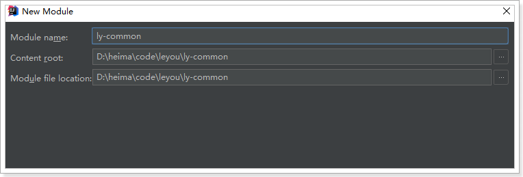

# 0.学习目标

- 了解电商行业
- 了解乐优商城项目结构
- 能独立搭建项目基本框架
- 能参考使用ES6的新语法


# 1.了解电商行业

学习电商项目，自然要先了解这个行业，所以我们首先来聊聊电商行业

## 1.1.项目分类

主要从需求方、盈利模式、技术侧重点这三个方面来看它们的不同

### 1.1.1.传统项目

各种企业里面用的管理系统（ERP、HR、OA、CRM、物流管理系统。。。。。。。）

- 需求方：公司、企业内部
- 盈利模式：项目本身卖钱
- 技术侧重点：业务功能

 

### 1.1.2.互联网项目

门户网站、电商网站：baidu.com、qq.com、taobao.com、jd.com  ...... 

- 需求方：广大用户群体
- 盈利模式：虚拟币、增值服务、广告收益......
- 技术侧重点：网站性能、业务功能


而我们今天要聊的就是互联网项目中的重要角色：电商


## 1.2.电商行业的发展

### 1.2.1.钱景

近年来，中国的电子商务快速发展，交易额连创新高，电子商务在各领域的应用不断拓展和深化、相关服务业蓬勃发展、支撑体系不断健全完善、创新的动力和能力不断增强。电子商务正在与实体经济深度融合，进入规模性发展阶段，对经济社会生活的影响不断增大，正成为我国经济发展的新引擎。

中国电子商务研究中心数据显示，截止到 2012 年底，中国电子商务市场交易规模达 7.85万亿人民币，同比增长 30.83%。其中，B2B 电子商务交易额达 6.25 万亿，同比增长 27%。而 2011 年全年，中国电子商务市场交易额达 6 万亿人民币，同比增长 33%，占 GDP 比重上升到 13%；2012 年，电子商务占 GDP 的比重已经高达 15%。

 	


### 1.2.2.数据

来看看双十一的成交数据：


2016双11开场30分钟，创造**每秒交易峰值17.5万笔**，**每秒**支付峰值**12万笔**的新纪录。菜鸟单日物流订单量超过**4.67亿**，创历史新高。


### 1.2.3.技术特点

从上面的数据我们不仅要看到钱，更要看到背后的技术实力。正是得益于电商行业的高强度并发压力，促使了BAT等巨头们的技术进步。电商行业有些什么特点呢？

- 技术范围广
- 技术新
- 高并发（分布式、静态化技术、缓存技术、异步并发、池化、队列）
- 高可用（集群、负载均衡、限流、降级、熔断）
- 数据量大
- 业务复杂
- 数据安全


## 1.3.常见电商模式

电商行业的一些常见模式：

- B2C：商家对个人，如：亚马逊、当当等
- C2C平台：个人对个人，如：咸鱼、拍拍网、ebay
- B2B平台：商家对商家，如：阿里巴巴、八方资源网等
- O2O：线上和线下结合，如：饿了么、电影票、团购等
- P2P：在线金融，贷款，如：网贷之家、人人聚财等。
- B2C平台：天猫、京东、一号店等


## 1.4.一些专业术语

- SaaS：软件即服务

- SOA：面向服务

- RPC：远程过程调用

- RMI：远程方法调用

- PV：(page view)，即页面浏览量；

  用户每1次对网站中的每个网页访问均被记录1次。用户对同一页面的多次访问，访问量累计

- UV：(unique visitor)，独立访客

  指访问某个站点或点击某条新闻的不同IP地址的人数。在同一天内，uv只记录第一次进入网站的具有独立IP的访问者，在同一天内再次访问该网站则不计数。

- PV与带宽：

  - 计算带宽大小需要关注两个指标：峰值流量和页面的平均大小。
  - 计算公式是：网站带宽= ( PV * 平均页面大小（单位MB）* 8 )/统计时间（换算到秒）
  - 为什么要乘以8？
    - 网站大小为单位是字节(Byte)，而计算带宽的单位是bit，1Byte=8bit
  - 这个计算的是平均带宽，高峰期还需要扩大一定倍数

- PV、QPS、并发

  - QPS：每秒处理的请求数量。8000/s
  
- 比如你的程序处理一个请求平均需要0.1S，那么1秒就可以处理10个请求。QPS自然就是10，多线程情况下，这个数字可能就会有所增加。
  
  - 由PV和QPS如何需要部署的服务器数量？
    - 根据二八原则，80%的请求集中在20%的时间来计算峰值压力：
    - （每日PV * 80%） / （3600s * 24 * 20%） * 每个页面的请求数  = 每个页面每秒的请求数量
  - 然后除以服务器的QPS值，即可计算得出需要部署的服务器数量
  
    


## 1.5.项目开发流程

项目经理：管人

产品经理：设计需求原型

测试：

前端：大前端。node

后端：

移动端：

项目开发流程图：

​		

公司现状：

​	


# 2.乐优商城介绍

## 2.1.项目介绍

- 乐优商城是一个全品类的电商购物网站（B2C）。
- 用户可以在线购买商品、加入购物车、下单、秒杀商品
- 可以品论已购买商品
- 管理员可以在后台管理商品的上下架、促销活动
- 管理员可以监控商品销售状况
- 客服可以在后台处理退款操作
- 希望未来3到5年可以支持千万用户的使用


## 2.2.系统架构

### 2.2.1.架构图

乐优商城架构缩略图，大图请参考课前资料：


### 2.2.2.系统架构解读

整个乐优商城可以分为两部分：后台管理系统、前台门户系统。

- 后台管理：

  - 后台系统主要包含以下功能：
    - 商品管理，包括商品分类、品牌、商品规格等信息的管理
    - 销售管理，包括订单统计、订单退款处理、促销活动生成等
    - 用户管理，包括用户控制、冻结、解锁等
    - 权限管理，整个网站的权限控制，采用JWT鉴权方案，对用户及API进行权限控制
    - 统计，各种数据的统计分析展示
  - 后台系统会采用前后端分离开发，而且整个后台管理系统会使用Vue.js框架搭建出单页应用（SPA）。
  - 预览图：

  

- 前台门户

  - 前台门户面向的是客户，包含与客户交互的一切功能。例如：
    - 搜索商品
    - 加入购物车
    - 下单
    - 评价商品等等
  - 前台系统我们会使用Thymeleaf模板引擎技术来完成页面开发。出于SEO优化的考虑，我们将不采用单页应用。

  


无论是前台还是后台系统，都共享相同的微服务集群，包括：

- 商品微服务：商品及商品分类、品牌、库存等的服务
- 搜索微服务：实现搜索功能
- 订单微服务：实现订单相关
- 购物车微服务：实现购物车相关功能
- 用户中心：用户的登录注册等功能
- Eureka注册中心
- Zuul网关服务
- Spring Cloud Config配置中心
- ...


# 3.项目搭建

## 3.1.技术选型

前端技术：

- 基础的HTML、CSS、JavaScript（基于ES6标准）
- JQuery
- Vue.js 2.0以及基于Vue的框架：Vuetify
- 前端构建工具：WebPack
- 前端安装包工具：NPM
- Vue脚手架：Vue-cli
- Vue路由：vue-router
- ajax框架：axios
- 基于Vue的富文本框架：quill-editor

后端技术：

- 基础的SpringMVC、Spring 5.0和MyBatis3
- Spring Boot 2.0.1版本
- Spring Cloud 最新版 Finchley.RC1
- Redis-4.0
- RabbitMQ-3.4
- Elasticsearch-5.6.8
- nginx-1.10.2：
- FastDFS - 5.0.8
- MyCat
- Thymeleaf

## 3.2.开发环境

为了保证开发环境的统一，希望每个人都按照我的环境来配置：

- IDE：我们使用Idea 2017.3 版本
- JDK：统一使用JDK1.8
- 项目构建：maven3.3.9以上版本即可
- 版本控制工具：git


idea大家可以在我的课前资料中找到。另外，使用帮助大家可以参考课前资料的《idea使用指南.md》


## 3.3.域名

我们在开发的过程中，为了保证以后的生产、测试环境统一。尽量都采用域名来访问项目。

一级域名：www.leyou.com

二级域名：manage.leyou.com , api.leyou.com

我们可以通过switchhost工具来修改自己的host对应的地址，只要把这些域名指向127.0.0.1，那么跟你用localhost的效果是完全一样的。

switchhost可以去课前资料寻找。


## 3.4.创建父工程

创建统一的父工程：leyou，用来管理依赖及其版本，注意是创建project，而不是moudle


填写项目信息：


注意：

父工程不需要代码，只是管理依赖，因此我们不选择任何SpringCloud的依赖

跳过依赖选择。


填写保存的位置信息：


然后将pom文件修改成我这个样子：

```xml
<?xml version="1.0" encoding="UTF-8"?>
<project xmlns="http://maven.apache.org/POM/4.0.0" xmlns:xsi="http://www.w3.org/2001/XMLSchema-instance"
	xsi:schemaLocation="http://maven.apache.org/POM/4.0.0 http://maven.apache.org/xsd/maven-4.0.0.xsd">
	<modelVersion>4.0.0</modelVersion>

	<groupId>com.leyou.parent</groupId>
	<artifactId>leyou</artifactId>
	<version>1.0.0-SNAPSHOT</version>
	<packaging>pom</packaging>

	<name>leyou</name>
	<description>Demo project for Spring Boot</description>

	<parent>
		<groupId>org.springframework.boot</groupId>
		<artifactId>spring-boot-starter-parent</artifactId>
		<version>2.0.1.RELEASE</version>
		<relativePath/> <!-- lookup parent from repository -->
	</parent>

	<properties>
		<project.build.sourceEncoding>UTF-8</project.build.sourceEncoding>
		<project.reporting.outputEncoding>UTF-8</project.reporting.outputEncoding>
		<java.version>1.8</java.version>
		<spring-cloud.version>Finchley.RC1</spring-cloud.version>
		<mybatis.starter.version>1.3.2</mybatis.starter.version>
		<mapper.starter.version>2.0.2</mapper.starter.version>
		<druid.starter.version>1.1.9</druid.starter.version>
		<mysql.version>5.1.32</mysql.version>
		<pageHelper.starter.version>1.2.3</pageHelper.starter.version>
		<leyou.latest.version>1.0.0-SNAPSHOT</leyou.latest.version>
		<fastDFS.client.version>1.26.1-RELEASE</fastDFS.client.version>
	</properties>

	<dependencyManagement>
		<dependencies>
			<!-- springCloud -->
			<dependency>
				<groupId>org.springframework.cloud</groupId>
				<artifactId>spring-cloud-dependencies</artifactId>
				<version>${spring-cloud.version}</version>
				<type>pom</type>
				<scope>import</scope>
			</dependency>
			<!-- mybatis启动器 -->
			<dependency>
				<groupId>org.mybatis.spring.boot</groupId>
				<artifactId>mybatis-spring-boot-starter</artifactId>
				<version>${mybatis.starter.version}</version>
			</dependency>
			<!-- 通用Mapper启动器 -->
			<dependency>
				<groupId>tk.mybatis</groupId>
				<artifactId>mapper-spring-boot-starter</artifactId>
				<version>${mapper.starter.version}</version>
			</dependency>
			<!-- 分页助手启动器 -->
			<dependency>
				<groupId>com.github.pagehelper</groupId>
				<artifactId>pagehelper-spring-boot-starter</artifactId>
				<version>${pageHelper.starter.version}</version>
			</dependency>
			<!-- mysql驱动 -->
			<dependency>
				<groupId>mysql</groupId>
				<artifactId>mysql-connector-java</artifactId>
				<version>${mysql.version}</version>
			</dependency>
			<!--FastDFS客户端-->
			<dependency>
				<groupId>com.github.tobato</groupId>
				<artifactId>fastdfs-client</artifactId>
				<version>${fastDFS.client.version}</version>
			</dependency>
          </dependencies>
	</dependencyManagement>

	<build>
		<plugins>
			<plugin>
				<groupId>org.springframework.boot</groupId>
				<artifactId>spring-boot-maven-plugin</artifactId>
			</plugin>
		</plugins>
	</build>

	<repositories>
		<repository>
			<id>spring-milestones</id>
			<name>Spring Milestones</name>
			<url>https://repo.spring.io/milestone</url>
			<snapshots>
				<enabled>false</enabled>
			</snapshots>
		</repository>
	</repositories>
</project>

```

可以发现，我们在父工程中引入了SpringCloud等很多以后需要用到的依赖，以后创建的子工程就不需要自己引入了。


最后，删除自动生成的LeyouApplication启动类、测试类以及application.properties文件，我们不需要。

## 3.5.创建EurekaServer

### 3.5.1.创建工程

这个大家应该比较熟悉了。

我们的注册中心，起名为：ly-registry

这次我们就不Spring使用提供的脚手架了。直接创建maven项目，自然会继承父类的依赖：

选择新建module：

​	

选择maven安装，但是不要选择骨架：


然后填写项目坐标，我们的项目名称为ly-registry:


选择安装目录，因为是聚合项目，目录应该是在父工程leyou的下面：


### 3.5.2.添加依赖

添加EurekaServer的依赖：

```xml
<?xml version="1.0" encoding="UTF-8"?>
<project xmlns="http://maven.apache.org/POM/4.0.0"
         xmlns:xsi="http://www.w3.org/2001/XMLSchema-instance"
         xsi:schemaLocation="http://maven.apache.org/POM/4.0.0 http://maven.apache.org/xsd/maven-4.0.0.xsd">
    <parent>
        <artifactId>leyou</artifactId>
        <groupId>com.leyou.parent</groupId>
        <version>1.0.0-SNAPSHOT</version>
    </parent>
    <modelVersion>4.0.0</modelVersion>

    <groupId>com.leyou.common</groupId>
    <artifactId>ly-registry</artifactId>
    <version>1.0.0-SNAPSHOT</version>

    <dependencies>
        <dependency>
            <groupId>org.springframework.cloud</groupId>
            <artifactId>spring-cloud-starter-netflix-eureka-server</artifactId>
        </dependency>
    </dependencies>
</project>
```

### 3.5.3.编写启动类

```java
@SpringBootApplication
@EnableEurekaServer
public class LyRegistry {
    public static void main(String[] args) {
        SpringApplication.run(LyRegistry.class, args);
    }
}
```

### 3.5.4.配置文件

```yaml
server:
  port: 10086
spring:
  application:
    name: ly-registry
eureka:
  client:
    fetch-registry: false
    register-with-eureka: false
    service-url:
      defaultZone: http://127.0.0.1:${server.port}/eureka
  server:
    enable-self-preservation: false # 关闭自我保护
    eviction-interval-timer-in-ms: 5000 # 每隔5秒进行一次服务列表清理
```

### 3.5.5.项目的结构：

目前，整个项目的结构如图：

 


## 3.6.创建Zuul网关

### 3.6.1.创建工程

与上面类似，选择maven方式创建Module，然后填写项目名称，我们命名为：ly-api-gateway


填写保存的目录：



### 3.6.2.添加依赖

这里我们需要添加Zuul和EurekaClient的依赖：

```xml
<?xml version="1.0" encoding="UTF-8"?>
<project xmlns="http://maven.apache.org/POM/4.0.0"
         xmlns:xsi="http://www.w3.org/2001/XMLSchema-instance"
         xsi:schemaLocation="http://maven.apache.org/POM/4.0.0 http://maven.apache.org/xsd/maven-4.0.0.xsd">
    <parent>
        <artifactId>leyou</artifactId>
        <groupId>com.leyou.parent</groupId>
        <version>1.0.0-SNAPSHOT</version>
    </parent>
    <modelVersion>4.0.0</modelVersion>

    <groupId>com.leyou.common</groupId>
    <artifactId>ly-api-gateway</artifactId>
    <version>1.0.0-SNAPSHOT</version>

    <dependencies>
        <dependency>
            <groupId>org.springframework.cloud</groupId>
            <artifactId>spring-cloud-starter-netflix-zuul</artifactId>
        </dependency>
        <dependency>
            <groupId>org.springframework.cloud</groupId>
            <artifactId>spring-cloud-starter-netflix-eureka-client</artifactId>
        </dependency>
        <!--是springboot提供的微服务检测接口，默认对外提供几个接口：/info-->
        <dependency>
            <groupId>org.springframework.boot</groupId>
            <artifactId>spring-boot-starter-actuator</artifactId>
        </dependency>
    </dependencies>
</project>
```

### 3.6.3.编写启动类

```java
@SpringBootApplication
@EnableDiscoveryClient
@EnableZuulProxy
public class LyApiGateway {
    public static void main(String[] args) {
        SpringApplication.run(LyApiGateway.class, args);
    }
}
```


### 3.6.4.配置文件

```yaml
server:
  port: 10010
spring:
  application:
    name: api-gateway
eureka:
  client:
    service-url:
      defaultZone: http://127.0.0.1:10086/eureka
    registry-fetch-interval-seconds: 5
  instance:
    prefer-ip-address: true
    ip-address: 127.0.0.1
    instance-id: ${spring.application.name}:${server.port}
zuul:
  prefix: /api # 添加路由前缀
  retryable: true
ribbon:
  ConnectTimeout: 250 # 连接超时时间(ms)
  ReadTimeout: 2000 # 通信超时时间(ms)
  OkToRetryOnAllOperations: true # 是否对所有操作重试
  MaxAutoRetriesNextServer: 1 # 同一服务不同实例的重试次数
  MaxAutoRetries: 1 # 同一实例的重试次数
hystrix:
  command:
    default:
      execution:
        isolation:
          thread:
            timeoutInMillisecond: 10000 # 熔断超时时长：10000ms
```

### 3.6.5.项目结构

目前，leyou下有两个子模块：

- ly-registry：服务的注册中心（EurekaServer）
- ly-api-gateway：服务网关（Zuul）

目前，服务的结构如图所示：

 	


截止到这里，我们已经把基础服务搭建完毕，为了便于开发，统一配置中心（ConfigServer）我们留待以后添加。


## 3.7.创建商品微服务

既然是一个全品类的电商购物平台，那么核心自然就是商品。因此我们要搭建的第一个服务，就是商品微服务。其中会包含对于商品相关的一系列内容的管理，包括：

- 商品分类管理
- 品牌管理
- 商品规格参数管理
- 商品管理
- 库存管理

我们先完成项目的搭建：

### 3.7.1.微服务的结构

因为与商品的品类相关，我们的工程命名为`ly-item`.

需要注意的是，我们的ly-item是一个微服务，那么将来肯定会有其它系统需要来调用服务中提供的接口，因此肯定也会使用到接口中关联的实体类。

因此这里我们需要使用聚合工程，将要提供的接口及相关实体类放到独立子工程中，以后别人引用的时候，只需要知道坐标即可。

我们会在ly-item中创建两个子工程：

- ly-item-interface：主要是对外暴露的接口及相关实体类
- ly-item-service：所有业务逻辑及内部使用接口

调用关系如图所示：


### 3.7.2.创建父工程ly-item

依然是使用maven构建：



保存的位置：


不需要任何依赖，我们可以把项目打包方式设置为pom

```xml
<?xml version="1.0" encoding="UTF-8"?>
<project xmlns="http://maven.apache.org/POM/4.0.0"
         xmlns:xsi="http://www.w3.org/2001/XMLSchema-instance"
         xsi:schemaLocation="http://maven.apache.org/POM/4.0.0 http://maven.apache.org/xsd/maven-4.0.0.xsd">
    <parent>
        <artifactId>leyou</artifactId>
        <groupId>com.leyou.parent</groupId>
        <version>1.0.0-SNAPSHOT</version>
    </parent>
    <modelVersion>4.0.0</modelVersion>

    <groupId>com.leyou.service</groupId>
    <artifactId>ly-item</artifactId>
    <version>1.0.0-SNAPSHOT</version>
    <!-- 打包方式为pom -->
    <packaging>pom</packaging>
</project>
```


### 3.7.3.创建ly-item-interface

在ly-item工程上点击右键，选择new > module:

 

依然是使用maven构建，注意父工程是ly-item：


**注意**：接下来填写的目录结构需要自己手动完成，保存到`ly-item`下的`ly-item-interface`目录中：



点击Finish完成。

此时的项目结构：

​	

### 3.7.4.创建ly-item-service

与`ly-item-interface`类似，我们选择在`ly-item`上右键，新建module，然后填写项目信息：


填写存储位置，是在`/ly-item/ly-item-service`目录



点击Finish完成。

### 3.7.5.整个微服务结构

如图所示：

​	

我们打开ly-item的pom查看，会发现ly-item-interface和ly-item-service都已经称为module了：

​	

### 3.7.6.添加依赖

接下来我们给`ly-item-service`中添加依赖：

思考一下我们需要什么？

- Eureka客户端
- web启动器
- mybatis启动器
- 通用mapper启动器
- 分页助手启动器
- 连接池，我们用默认的Hykira
- mysql驱动
- 千万不能忘了，我们自己也需要`ly-item-interface`中的实体类

这些依赖，我们在顶级父工程：leyou中已经添加好了。所以直接引入即可：

```xml
<?xml version="1.0" encoding="UTF-8"?>
<project xmlns="http://maven.apache.org/POM/4.0.0"
         xmlns:xsi="http://www.w3.org/2001/XMLSchema-instance"
         xsi:schemaLocation="http://maven.apache.org/POM/4.0.0 http://maven.apache.org/xsd/maven-4.0.0.xsd">
    <parent>
        <artifactId>ly-item</artifactId>
        <groupId>com.leyou.service</groupId>
        <version>1.0.0-SNAPSHOT</version>
    </parent>
    <modelVersion>4.0.0</modelVersion>

    <groupId>com.leyou.service</groupId>
    <artifactId>ly-item-service</artifactId>
    <version>1.0.0-SNAPSHOT</version>

    <dependencies>
        <!--Eureka客户端-->
        <dependency>
            <groupId>org.springframework.cloud</groupId>
            <artifactId>spring-cloud-starter-netflix-eureka-client</artifactId>
        </dependency>
        <!--web启动器-->
        <dependency>
            <groupId>org.springframework.boot</groupId>
            <artifactId>spring-boot-starter-web</artifactId>
        </dependency>
        <!-- mybatis启动器 -->
        <dependency>
            <groupId>org.mybatis.spring.boot</groupId>
            <artifactId>mybatis-spring-boot-starter</artifactId>
            <version>${mybatis.starter.version}</version>
        </dependency>
        <!-- 通用Mapper启动器 -->
        <dependency>
            <groupId>tk.mybatis</groupId>
            <artifactId>mapper-spring-boot-starter</artifactId>
            <version>${mapper.starter.version}</version>
        </dependency>
        <!-- 分页助手启动器 -->
        <dependency>
            <groupId>com.github.pagehelper</groupId>
            <artifactId>pagehelper-spring-boot-starter</artifactId>
            <version>${pageHelper.starter.version}</version>
        </dependency>
        <!-- mysql驱动 -->
        <dependency>
            <groupId>mysql</groupId>
            <artifactId>mysql-connector-java</artifactId>
            <version>${mysql.version}</version>
        </dependency>
        <dependency>
            <groupId>com.leyou.service</groupId>
            <artifactId>ly-item-interface</artifactId>
            <version>${leyou.latest.version}</version>
        </dependency>
        <dependency>
            <groupId>org.springframework.boot</groupId>
            <artifactId>spring-boot-starter-actuator</artifactId>
        </dependency>
    </dependencies>
</project>
```


ly-item-interface中需要什么我们暂时不清楚，所以先不管。

整个结构：

 


### 3.7.7.编写启动和配置

在整个`ly-item工程`中，只有`ly-item-service`是需要启动的。因此在其中编写启动类即可：

```java
@SpringBootApplication
@EnableDiscoveryClient
public class LyItemService {
    public static void main(String[] args) {
        SpringApplication.run(LyItemService.class, args);
    }
}

```


然后是全局属性文件：

```yaml
server:
  port: 8081
spring:
  application:
    name: item-service
  datasource:
    url: jdbc:mysql://localhost:3306/heima
    username: root
    password: 123
    hikari:
      maximum-pool-size: 30
      minimum-idle: 10
eureka:
  client:
    service-url:
      defaultZone: http://127.0.0.1:10086/eureka
  instance:
    lease-renewal-interval-in-seconds: 5 # 每隔5秒发送一次心跳
    lease-expiration-duration-in-seconds: 10 # 10秒不发送就过期
    prefer-ip-address: true
    ip-address: 127.0.0.1
    instance-id: ${spring.application.name}:${server.port}
```


## 3.8.添加商品微服务的路由规则

既然商品微服务已经创建，接下来肯定要添加路由规则到Zuul中，我们不使用默认的路由规则。

```yaml
zuul:
  prefix: /api # 添加路由前缀
  retryable: true
  routes:
    item-service: /item/** # 将商品微服务映射到/item/**
```


## 3.9.启动测试

我们分别启动：ly-registry，ly-api-gateway，ly-item-service

 

查看Eureka面板：


## 3.10.测试路由规则

为了测试路由规则是否畅通，我们是不是需要在item-service中编写一个controller接口呢？

其实不需要，Spring提供了一个依赖：actuator

只要我们添加了actuator的依赖，它就会为我们生成一系列的访问接口：

- /info
- /health
- /refresh
- ...

添加依赖：

```xml
<dependency>
    <groupId>org.springframework.boot</groupId>
    <artifactId>spring-boot-starter-actuator</artifactId>
</dependency>
```

重启后访问Eureka控制台：

鼠标悬停在item-service上，会显示一个地址：


这就是actuator提供的接口，我们点击访问：

 

因为我们没有添加信息，所以是一个空的json，但是可以肯定的是：我们能够访问到item-service了。

接下来我们通过路由访问试试，根据路由规则，我们需要访问的地址是：

http://127.0.0.1:10010/api/item/actuator/info

 


## 3.11.通用工具模块

有些工具或通用的约定内容，我们希望各个服务共享，因此需要创建一个工具模块：`ly-common`


使用maven来构建module：


位置信息：




结构：

 

目前还不需要编码。


# 4.前台页面

- 了解vue-router使用
- 了解webpack使用
- 会使用vue-cli搭建项目
- 独立搭建后台管理系统
- 了解系统基本结构


# 4.1.路由vue-router

## 1.1.场景模拟

现在我们来实现这样一个功能：

一个页面，包含登录和注册，点击不同按钮，实现登录和注册页切换：

 


### 1.1.1.编写父组件

为了让接下来的功能比较清晰，我们先新建一个文件夹：src:

 

然后新建一个HTML文件，作为入口：index.html

 

然后编写页面的基本结构：

```html
<div id="app">
    <span>登录</span>
    <span>注册</span>
    <hr/>
    <div>
        登录页/注册页
    </div>
</div>
<script src="../node_modules/vue/dist/vue.js"></script>
<script type="text/javascript">
    var vm = new Vue({
        el:"#app"
    })
</script>
```

样式：

 


### 1.1.2.编写登录组件

接下来我们来实现登录组件，以前我们都是写在一个文件中，但是为了复用性，开发中都会把组件放如独立的JS文件中，我们新建一个login.js

 

编写组件，这里我们只写模板，不写功能：

```js
const loginForm = {
    template:'\
    <div>\
    <h2>登录页</h2> \
    用户名：<input type="text"><br/>\
    密码：<input type="password"><br/>\
    </div>\
    '
}
```

### 1.1.3.编写注册组件

新建单文件组件：register.js

 

编写模板：

```js
const registerForm = {
    template:'\
    <div>\
    <h2>注册页</h2> \
    用户名：<input type="text"><br/>\
    密码：<input type="password"><br/>\
    确认密码：<input type="password"><br/>\
    </div>\
    '
}
```

### 1.1.4.在父组件中引用

在index.html中使用刚刚编写的两个组件

```html
    <div id="app">
        <span>登录</span>
        <span>注册</span>
        <hr/>
        <div>
            <login-form></login-form>
            <register-form></register-form>
        </div>
    </div>
    <script src="../node_modules/vue/dist/vue.js"></script>
    <script src="js/login.js"></script>
    <script src="js/register.js"></script>
    <script type="text/javascript">
        var vm = new Vue({
            el:"#app",
            components:{// 引用登录和注册组件
                loginForm,
                registerForm
            }
        })
    </script>
```

效果：

 

### 1.1.5.问题

我们期待的是，当点击登录或注册按钮，分别显示登录页或注册页，而不是一起显示。

但是，如何才能动态加载组件，实现组件切换呢？

虽然使用原生的Html5和JS也能实现，但是官方推荐我们使用vue-router模块。


## 1.2.vue-router简介和安装

使用vue-router和vue可以非常方便的实现 复杂单页应用的动态路由功能。

官网：https://router.vuejs.org/zh-cn/

使用npm安装：`npm install vue-router --save` 

 

在index.html中引入依赖：

```html
<script src="../node_modules/vue-router/dist/vue-router.js"></script>
```


## 1.3.快速入门

新建vue-router对象，并且指定路由规则：

```js
// 创建VueRouter对象
const router = new VueRouter({
    routes:[ // 编写多个路由规则
        {
            path:"/login", // 请求路径
            component:loginForm // 组件名称
        },
        {path:"/register",component:registerForm},
    ]
})
```

- 创建VueRouter对象，并指定路由参数
- routes：路由规则的数组，可以指定多个对象，每个对象是一条路由规则，包含以下属性：
  - path：路由的路径
  - component：组件名称

在父组件中引入router对象：

```js
var vm = new Vue({
    el:"#app",
    components:{// 引用登录和注册组件
        loginForm,
        registerForm
    },
    router // 引用上面定义的router对象
})
```


页面跳转控制：

```html
<div id="app">
    <!--router-link来指定跳转的路径-->
    <span><router-link to="/login">登录</router-link></span>
    <span><router-link to="/register">注册</router-link></span>
    <hr/>
    <div>
        <!--vue-router的锚点-->
        <router-view></router-view>
    </div>
</div>
```

- 通过`<router-view>`来指定一个锚点，当路由的路径匹配时，vue-router会自动把对应组件放到锚点位置进行渲染
- 通过`<router-link>`指定一个跳转链接，当点击时，会触发vue-router的路由功能，路径中的hash值会随之改变

效果：

 


**注意**：单页应用中，页面的切换并不是页面的跳转。仅仅是地址最后的hash值变化。

事实上，我们总共就一个HTML：index.html


## 1.4.父子组件


# 4.2.webpack

## 2.1.认识webpack

Webpack 是一个前端资源的打包工具，它可以将js、image、css等资源当成一个模块进行打包。

中文官方网站：https://www.webpackjs.com/


官网给出的解释：


为什么需要打包？

- 将许多碎小文件打包成一个整体，减少单页面内的衍生请求次数，提高网站效率。
- 将ES6的高级语法进行转换编译，以兼容老版本的浏览器。
- 将代码打包的同时进行混淆，提高代码的安全性。

## 2.2.四个核心概念

学习Webpack，你需要先理解四个**核心概念**：

- 入口(entry)

  webpack打包的启点，可以有一个或多个，一般是js文件。webpack会从启点文件开始，寻找启点直接或间接依赖的其它所有的依赖，包括JS、CSS、图片资源等，作为将来打包的原始数据

- 输出(output)

  出口一般包含两个属性：path和filename。用来告诉webpack打包的目标文件夹，以及文件的名称。目的地也可以有多个。

- 加载器（loader）

  webpack本身只识别Js文件，如果要加载非JS文件，必须指定一些额外的加载器（loader），例如css-loader。然后将这些文件转为webpack能处理的有效模块，最后利用webpack的打包能力去处理。

- 插件(plugins)

  插件可以扩展webpack的功能，让webpack不仅仅是完成打包，甚至各种更复杂的功能，或者是对打包功能进行优化、压缩，提高效率。


## 2.3.安装

webpack支持全局安装和本地安装，官方推荐是本地安装，我们按照官方的来。

输入命令：`npm install webpack webpack-cli --save-dev`


此时，我们注意下项目中文件夹下，会有一个package.json文件。（其实早就有了）

 

打开文件，可以看到我们之前用npm安装过的文件都会出现在这里：

 


## 2.4.编写webpack配置

接下来，我们编写一个webpack的配置，来指定一些打包的配置项。配置文件的名称，默认就是webpack.config.js，我们放到hello-vue的根目录：

 

配置文件中就是要指定上面说的四个核心概念，入口、出口、加载器、插件。

不过，加载器和插件是可选的。我们先编写入口和出口


### 2.4.1.入口entry

webpack打包的启点，可以有一个或多个，一般是js文件。现在思考一下我们有没有一个入口？貌似没有，我们所有的东西都集中在index.html，不是一个js，那怎么办？

我们新建一个js，把index.html中的部分内容进行集中，然后在index.html中引用这个js不就OK了！

 

然后把原来index.html中的js代码全部移动到main.js中

```js
// 使用es6的语法导入js模块
import Vue from '../node_modules/vue/dist/vue';
import VueRouter from '../node_modules/vue-router/dist/vue-router'
import loginForm from './js/login'
import registerForm from './js/register'

Vue.use(VueRouter)

// 创建VueRouter对象
const router = new VueRouter({
    routes:[ // 编写多个路由规则
        {
            path:"/login", // 请求路径
            component:loginForm // 组件名称
        },
        {path:"/register",component:registerForm},
    ]
})
var vm = new Vue({
    el:"#app",
    components:{// 引用登录和注册组件
        loginForm,
        registerForm
    },
    router
})
```

- 原来的index.html中引入了很多其它js，在这里我们使用es6的import语法进行导入。

  注意，要使用import，就需要在login.js和register.js中添加export导出语句：

  ```js
  const loginForm = {
      template:`
      <div> 
      <h2>登录页</h2> 
      用户名：<input type="text"><br/>
      密码：<input type="password"><br/>
      </div>
      `
  }
  export default loginForm;
  ```

  register.js:

  ```js
  const registerForm = {
      template:`
      <div>
      <h2>注册页</h2> 
      用户名：<input type="text"><br/>
      密码：<input type="password"><br/>
      确认密码：<input type="password"><br/>
      </div>
      `
  }
  export default registerForm;
  
  ```

  

- vue-router使用模块话加载后，必须增加一句：Vue.use(VueRouter)

这样，main.js就成了我们整个配置的入口了。


我们在webpack.config.js中添加以下内容：

```js
module.exports={
    entry:'./src/main.js',  //指定打包的入口文件
}
```

### 2.4.2.出口output

出口，就是输出的目的地。一般我们会用一个dist目录，作为打包输出的文件夹：

 

然后，编写webpack.config.js，添加出口配置：

```js
module.exports={
    entry:'./src/main.js',  //指定打包的入口文件
    output:{
        // path: 输出的目录，__dirname是相对于webpack.config.js配置文件的绝对路径
        path : __dirname+'/dist',  
        filename:'build.js'	 //输出的js文件名
    }
}
```


## 2.5.执行打包

在控制台输入以下命令：

```
npx webpack --config webpack.config.js

```


随后，查看dist目录：

 

尝试打开build.js，你根本看不懂：


所有的js合并为1个，并且对变量名进行了随机打乱，这样就起到了 压缩、混淆的作用。


## 2.6.测试运行

在index.html中引入刚刚生成的build.js文件，

```html
<!DOCTYPE html>
<html lang="en">
<head>
    <meta charset="UTF-8">
    <title>Title</title>
</head>
<body>
    <div id="app">
        <!--router-link来指定跳转的路径-->
        <span><router-link to="/login">登录</router-link></span>
        <span><router-link to="/register">注册</router-link></span>
        <hr/>
        <div>
            <!--vue-router的锚点-->
            <router-view></router-view>
        </div>
    </div>
    <script src="../dist/build.js"></script>
</body>
</html>
```


然后运行：

 


## 2.7.打包CSS

### 2.7.1.编写css文件

我们来编写一段CSS代码，对index的样式做一些美化：

 

内容：

```css
#app a{
    display: inline-block;
    width: 150px;
    line-height: 30px;
    background-color: dodgerblue;
    color: white;
    font-size: 16px;
    text-decoration: none;
}
#app a:hover{
    background-color: whitesmoke;
    color: dodgerblue;
}
#app div{
    width: 300px;
    height: 150px;
}
#app{
    width: 305px;
    border: 1px solid dodgerblue;
}
```

### 2.7.2.安装加载器

前面说过，webpack默认只支持js加载。要加载CSS文件，必须安装加载器：

命令：

```
npm install style-loader css-loader --save-dev

```


此时，在package.json中能看到新安装的：

 


### 2.7.3.在main.js引入css文件

因为入口在main.js，因此css文件也要在这里引入。依然使用ES6 的模块语法：

```js
import './css/main.css'
```

### 2.7.4.在webpack.config.js添加加载器

```js
module.exports = {
    entry: './src/main.js',  //指定打包的入口文件
    output: {
        path: __dirname + '/dist', // 注意：__dirname表示webpack.config.js所在目录的绝对路径
        filename: 'build.js'  //输出文件
    },
    module: {
        rules: [
            {
                test: /\.css$/, // 通过正则表达式匹配所有以.css后缀的文件
                use: [ // 要使用的加载器，这两个顺序一定不要乱
                    'style-loader',
                    'css-loader'
                ]
            }
        ]
    }
}
```

### 2.7.5.重新打包

再次输入打包指令：`npx webpack --config webpack.config.js`

 

效果：

 


## 2.8.script脚本

我们每次使用npm安装，都会在package.json中留下痕迹，事实上，package.json中不仅可以记录安装的内容，还可编写脚本，让我们运行命令更加快捷。

我们可以把webpack的命令编入其中：

 

以后，如果要打包，就可以直接输入：`npm run build`即可。

- `npm run` ：执行npm脚本，后面跟的是脚本的名称`build`


## 2.9.打包HTML

之前的打包过程中，除了HTML文件外的其它文件都被打包了，当在线上部署时，我们还得自己复制HTML到dist，然后手动添加生成的js到HTML中，这非常不友好。

webpack中的一个插件：html-webpack-plugin，可以解决这个问题。

1）安装插件：`npm install --save-dev html-webpack-plugin`

需要在webpack.config.js中添加插件：

```js
const HtmlWebpackPlugin = require('html-webpack-plugin');

module.exports = {
    entry: './src/main.js',  //指定打包的入口文件
    output: {
        path: __dirname + '/dist',  // 注意：__dirname表示webpack.config.js所在目录的绝对路径
        filename: 'build.js'		   //输出文件
    },
    module: {
        rules: [
            {
                test: /\.css$/, // 通过正则表达式匹配所有以.css后缀的文件
                use: [ // 要使用的加载器，这两个顺序一定不要乱
                    'style-loader',
                    'css-loader'
                ]
            }
        ]
    },
    plugins:[
        new HtmlWebpackPlugin({
            title: '首页',  //生成的页面标题<head><title>首页</title></head>
            filename: 'index.html', // dist目录下生成的文件名
            template: './src/index.html' // 我们原来的index.html，作为模板
        })
    ]
}
```


2）将原来HTML中的引入js代码删除：

  

3）再次打包：`npm run build`


4）查看dist目录：

 

打开index.html，发现已经自动添加了当前目录下的build.js

```html
<!DOCTYPE html>
<html lang="en">
<head>
    <meta charset="UTF-8">
    <title>Title</title>
</head>
<body>
    <div id="app">
        <!--router-link来指定跳转的路径-->
        <span><router-link to="/login">登录</router-link></span>
        <span><router-link to="/register">注册</router-link></span>
        <div>
            <!--vue-router的锚点-->
            <router-view></router-view>
        </div>
    </div>
<script type="text/javascript" src="build.js"></script></body>
</html>
```


## 2.10.热更新的web服务

刚才的案例中，每次修改任何js或css内容，都必须重新打包，非常麻烦。


webpack给我们提供了一个插件，可以帮我们运行一个web服务，加载页面内容，并且修改js后不需要重新加载就能看到最新结果：

1）安装插件：

```
npm install webpack-dev-server --save-dev
```

2）添加启动脚本

在package.json中配置script

```js
  "scripts": {
    "dev": "webpack-dev-server --inline --hot --open --port 8080 --host 127.0.0.1"
  },
```

--inline：自动刷新

--hot：热加载

--port：指定端口

--open：自动在默认浏览器打开

--host：可以指定服务器的 ip，不指定则为127.0.0.1


3）运行脚本：

```
npm run dev
```


 

4）效果：

 

# 4.3.vue-cli

## 3.1.介绍和安装

在开发中，需要打包的东西不止是js、css、html。还有更多的东西要处理，这些插件和加载器如果我们一一去添加就会比较麻烦。

幸好，vue官方提供了一个快速搭建vue项目的脚手架：vue-cli

使用它能快速的构建一个web工程模板。

官网：https://github.com/vuejs/vue-cli

安装命令：

```
npm install -g vue-cli
```


## 3.2.快速上手

我们新建一个module：

 

打开终端并进入目录：

 

用vue-cli命令，快速搭建一个webpack的项目：`vue init webpack`


 

前面几项都走默认或yes

下面这些我们选no

 

最后，再选yes，使用 npm安装

 


## 3.3.项目结构

安装好的项目结构：

 


入口文件：


## 3.4.单文件组件

需要注意的是，我们看到有一类后缀名为.vue的文件，我们称为单文件组件


每一个.vue文件，就是一个独立的vue组件。类似于我们刚才写的loginForm.js和registerForm.js

只不过，我们在js中编写 html模板和样式非常的不友好，而且没有语法提示和高亮。


而单文件组件中包含三部分内容：

- template：模板，支持html语法高亮和提示
- script：js脚本，这里编写的就是vue的组件对象，看到上面的data(){}了吧
- style：样式，支持CSS语法高亮和提示

每个组件都有自己独立的html、JS、CSS，互不干扰，真正做到可独立复用。


## 3.5.运行

看看生成的package.json：


- 可以看到这引入了非常多的依赖，绝大多数都是开发期依赖，比如大量的加载器。
- 运行时依赖只有vue和vue-router
- 脚本有三个：
  - dev：使用了webpack-dev-server命令，开发时热部署使用
  - start：使用了npm run dev命令，与上面的dev效果完全一样
  - build：等同于webpack的打包功能，会打包到dist目录下。

我们执行`npm run dev` 或者 `npm start` 都可以启动项目：

 


页面：


# 4.4.搭建后台管理前端

## 4.1.导入已有资源

后台项目相对复杂，为了有利于教学，我们不再从0搭建项目，而是直接使用课前资料中给大家准备好的源码：

 

我们解压缩，放到工作目录中：

 


然后在eclipse中导入新的工程：

 

选中我们的工程：

 


这正是一个用vue-cli构建的webpack工程，是不是与昨天的一样：

 

## 4.2.安装依赖

你应该注意到，这里并没有node_modules文件夹，方便给大家下发，已经把依赖都删除了。不过package.json中依然定义了我们所需的一切依赖：

 

我们只需要通过命令来安装所需依赖即可。打开终端，进入项目目录，输入：`npm install`

 

大概需要1分钟。

## 4.3.运行一下看看

输入命令：

```
npm run dev
```

 

发现默认的端口是9001。访问：http://localhost:9001

会自动进行跳转：


# 4.5.Vuetify框架

## 5.1.为什么要学习UI框架

Vue负责的是虽然会帮我们进行视图的渲染，但是样式是有我们自己来完成。这显然不是我们的强项，因此后端开发人员一般都喜欢使用一些现成的UI组件，拿来即用，常见的例如：

- BootStrap
- LayUI
- EasyUI
- ZUI

然而这些UI组件的基因天生与Vue不合，因为他们更多的是利用DOM操作，借助于jQuery实现，而不是MVVM的思想。

而目前与Vue吻合的UI框架也非常的多，国内比较知名的如：

- element-ui：饿了么出品
- i-view：某公司出品

然而我们都不用，我们今天推荐的是一款国外的框架：Vuetify

官方网站：https://vuetifyjs.com/zh-Hans/


## 5.2.为什么是Vuetify

有中国的为什么还要用外国的？原因如下：

- Vuetify几乎不需要任何CSS代码，而element-ui许多布局样式需要我们来编写
- Vuetify从底层构建起来的语义化组件。简单易学，容易记住。
- Vuetify基于Material Design（谷歌推出的多平台设计规范），更加美观，动画效果酷炫，且风格统一

这是官网的说明：


缺陷：

- 目前官网虽然有中文文档，但因为翻译问题，几乎不太能看。


## 5.3.怎么用？

基于官方网站的文档进行学习：


我们重点关注`UI components`即可，里面有大量的UI组件，我们要用的时候再查看，不用现在学习，先看下有什么：

 


 

以后用到什么组件，就来查询即可。


# 4.6.项目结构

开始编码前，我们先了解下项目的结构：

## 6.1.目录结构

首先是目录结构图：


## 6.2.调用关系

我们最主要理清index.html、main.js、App.vue之间的关系：


理一下：

- index.html中定义了空的`div`，其id为`app`。
- main.js中定义了Vue对象，并且绑定通过id选择器，绑定到index.html的div中，因此**main.js的内容都将在index.html的div中显示**。
- 而main.js中只有一行内容：`<App/>`,这是使用了App组件，即App.vue，也就是说index.html中最终展现的是App.vue中的内容。
- App.vue中也没有内容，而是定义了vue-router的锚点：`<router-view>`,我们之前讲过，vue-router路由后的组件将会在锚点展示。
- 最终的结论是：**一切路由后的内容都将通过App.vue在index.html中显示。**


## 6.3.页面布局

接下来我们一起看下页面布局：

Layout组件是我们的整个页面的布局组件：


一个典型的三块布局。包含左，上，中三部分：

 


里面使用了Vuetify中的2个组件和一个布局元素：

- `v-navigation-drawer` ：导航抽屉，主要用于容纳应用程序中的页面的导航链接。 

  

- `v-toolbar `：工具栏通常是网站导航的主要途径。可以与导航抽屉一起很好地工作，动态选择是否打开导航抽屉，实现可伸缩的侧边栏。

  

- `v-content`：并不是一个组件，而是标记页面布局的元素。可以根据您指定的**app**组件的结构动态调整大小，使得您可以创建高度可定制的组件。

那么问题来了：`v-content`中的内容来自哪里？


- Layout映射的路径是`/`
- 除了Login以为的所有组件，都是定义在Layout的children属性，并且路径都是`/`的下面
- 因此当路由到子组件时，会在Layout中定义的锚点中显示。
- 并且Layout中的其它部分不会变化，这就实现了布局的共享。