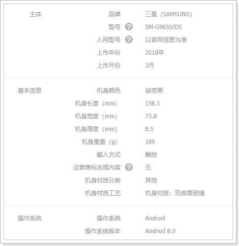
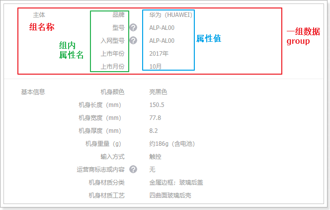
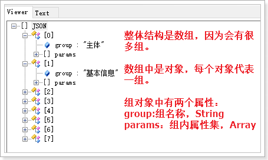
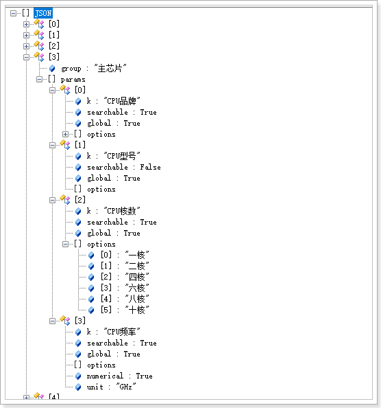
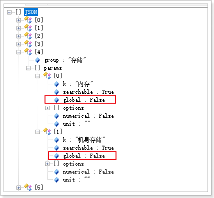
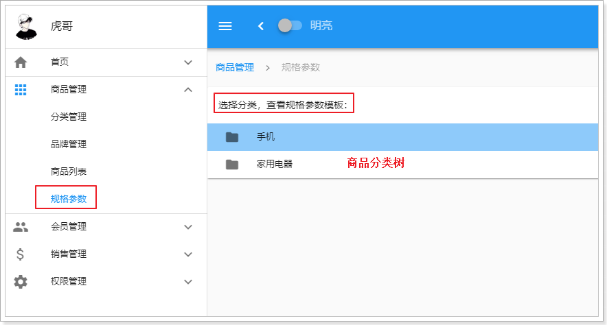
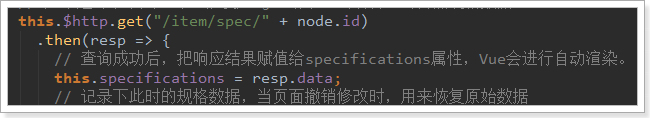
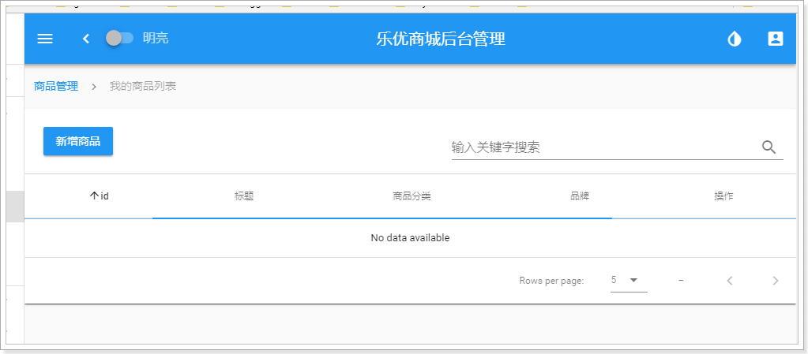
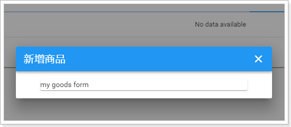

# 0.学习目标

- 了解商品规格数据结构设计思路
- 实现商品规格查询
- 了解SPU和SKU数据结构设计思路
- 实现商品查询
- 了解商品新增的页面实现
- 独立编写商品新增后台功能


# 1.商品规格数据结构

乐优商城是一个全品类的电商网站，因此商品的种类繁多，每一件商品，其属性又有差别。为了更准确描述商品及细分差别，抽象出两个概念：SPU和SKU，了解一下：

## 1.1.SPU和SKU

SPU：Standard Product Unit （标准产品单位） ，一组具有共同属性的商品集

SKU：Stock Keeping Unit（库存量单位），SPU商品集因具体特性不同而细分的每个商品

以图为例来看：


- 本页的 华为Mate10 就是一个商品集（SPU）
- 因为颜色、内存等不同，而细分出不同的Mate10，如亮黑色128G版。（SKU）

可以看出：

- SPU是一个抽象的商品集概念，为了方便后台的管理。
- SKU才是具体要销售的商品，每一个SKU的价格、库存可能会不一样，用户购买的是SKU而不是SPU


## 1.2.数据库设计分析

### 1.2.1.思考并发现问题

弄清楚了SPU和SKU的概念区分，接下来我们一起思考一下该如何设计数据库表。

首先来看SPU，大家一起思考下SPU应该有哪些字段来描述？

```
id:主键
title：标题
description：描述
specification：规格
packaging_list：包装
after_service：售后服务
comment：评价
category_id：商品分类
brand_id：品牌
```

似乎并不复杂，但是大家仔细思考一下，商品的规格字段你如何填写？

 

不同商品的规格不一定相同，数据库中要如何保存？


再看下SKU，大家觉得应该有什么字段？

```
id：主键
spu_id：关联的spu
price：价格
images：图片
stock：库存
颜色？
内存？
硬盘？
```

碰到难题了，不同的商品分类，可能属性是不一样的，比如手机有内存，衣服有尺码，我们是全品类的电商网站，这些不同的商品的不同属性，如何设计到一张表中？


### 1.2.2.分析规格参数

仔细查看每一种商品的规格你会发现：

虽然商品规格千变万化，但是同一类商品（如手机）的规格是统一的，有图为证：

> 华为的规格：

 


> 三星的规格：

 


也就是说，商品的规格参数应该是与分类绑定的。**每一个分类都有统一的规格参数模板，但不同商品其参数值可能不同**。

如下图所示：

 

### 1.2.3.SKU的特有属性

SPU中会有一些特殊属性，用来区分不同的SKU，我们称为SKU特有属性。如华为META10的颜色、内存属性。

不同种类的商品，一个手机，一个衣服，其SKU属性不相同。

同一种类的商品，比如都是衣服，SKU属性基本是一样的，都是颜色、尺码等。

这样说起来，似乎SKU的特有属性也是与分类相关的？事实上，仔细观察你会发现，**SKU的特有属性是商品规格参数的一部分**：


也就是说，我们没必要单独对SKU的特有属性进行设计，它可以看做是规格参数中的一部分。这样规格参数中的属性可以标记成两部分：

- 所有sku共享的规格属性（称为全局属性）
- 每个sku不同的规格属性（称为特有属性）


### 1.2.4.搜索属性

打开一个搜索页，我们来看看过滤的条件：


你会发现，过滤条件中的屏幕尺寸、运行内存、网路、机身内存、电池容量、CPU核数等，在规格参数中都能找到：

 

也就是说，规格参数中的数据，将来会有一部分作为搜索条件来使用。我们可以在设计时，将这部分属性标记出来，将来做搜索的时候，作为过滤条件。要注意的是，无论是SPU的全局属性，还是SKU的特有属性，都有可能作为搜索过滤条件的，并不冲突，而是有一个交集：

 


## 1.3.规格参数表

### 1.3.1.表结构

先看下规格参数表：

```mysql
CREATE TABLE `tb_specification` (
  `category_id` bigint(20) NOT NULL COMMENT '规格模板所属商品分类id',
  `specifications` varchar(3000) NOT NULL DEFAULT '' COMMENT '规格参数模板，json格式',
  PRIMARY KEY (`category_id`)
) ENGINE=InnoDB DEFAULT CHARSET=utf8 COMMENT='商品规格参数模板，json格式。';
```

很奇怪是吧，只有两个字段。特别需要注意的是第二个字段：

- specificatons：规格参数模板，json格式

为什么是一个json？我们看下规格参数的格式：



如果按照传统数据库设计，这里至少需要3张表：

- group：代表组，与商品分类关联
- param_key：属性名，与组关联，一对多
- param_value：属性备选值，与属性名关联，一对多

这样程序的复杂度大大增加，但是提高了数据的复用性。

我们的解决方案是，采用json来保存整个规格参数模板，不需要额外的表，一个字符串就够了。

### 1.3.2.json结构分析

> 先整体看一下：

 

- 因为规格参数分为很多组，所以json最外层是一个数组。
- 数组中是对象类型，每个对象代表一个组的数据，对象的属性包括：
  - group：组的名称
  - params：该组的所有属性

> 接下来是params：

 

以`主芯片`这一组为例：

- group：注明，这里是主芯片

- params：该组的所有规格属性，因为不止一个，所以是一个数组。这里包含四个规格属性：CPU品牌，CPU型号，CPU频率，CPU核数。每个规格属性都是一个对象，包含以下信息：
  - k：属性名称
  - searchable：是否作为搜索字段，将来在搜索页面使用，boolean类型
  - global：是否是SPU全局属性，boolean类型。true为全局属性，false为SKU的特有属性
  - options：属性值的可选项，数组结构。起约束作用，不允许填写可选项以外的值，比如CPU核数，有人添10000核岂不是很扯淡
  - numerical：是否为数值，boolean类型，true则为数值，false则不是。为空也代表非数值
  - unit：单位，如：克，毫米。如果是数值类型，那么就需要有单位，否则可以不填。

上面的截图中所有属性都是全局属性，我们来看看内存，应该是特有属性：

  


总结下：

- 规格参数分组，每组有多个参数
- 参数的 `k`代表属性名称，没有值，具体的SPU才能确定值
- 参数会有不同的属性：是否可搜索，是否是全局、是否是数值，这些都用boolean值进行标记：
  - SPU下的多个SKU共享的参数称为全局属性，用`global`标记
  - SPU下的多个SKU特有的参数称为特有属性
  - 如果参数是数值类型，用`numerical`标记，并且指定单位`unit`
  - 如果参数可搜索，用`searchable`标记


# 2.商品规格参数管理

## 2.1.页面实现

页面比较复杂，这里就不带着大家去实现完整页面效果了，我们一起分析一下即可。

### 2.1.1.整体布局

打开规格参数页面，看到如下内容：



因为规格是跟商品分类绑定的，因此首先会展现商品分类树，并且提示你要选择商品分类，才能看到规格参数的模板。一起了解下页面的实现：


可以看出页面分成3个部分：

- `v-card-title`：标题部分，这里是提示信息，告诉用户要先选择分类，才能看到模板

- `v-tree`：这里用到的是我们之前讲过的树组件，展示商品分类树，不过现在是假数据，我们只要把`treeData`属性删除，它就会走`url`属性指定的路径去查询真实的商品分类树了。

  ```js
  <v-tree url="/item/category/list" :isEdit="false"  @handleClick="handleClick" />
  ```

- `v-dialog`：Vuetify提供的对话框组件，v-model绑定的dialog属性是boolean类型：

  - true则显示弹窗
  - false则隐藏弹窗

### 2.1.2.data中定义的属性

接下来，看看Vue实例中data定义了哪些属性，对页面会产生怎样的影响：

 

- specifications：选中一个商品分类后，需要查询后台获取规格参数信息，保存在这个对象中，Vue会完成页面渲染。
- oldSpec：当前页兼具了规格的增、改、查等功能，这个对象记录被修改前的规格参数，以防用户撤销修改，用来恢复数据。
- dialog：是否显示对话框的标记。true则显示，false则不显示
- currentNode：记录当前选中的商品分类节点
- isInsert：判断接下来是新增还是修改


## 2.2.规格参数的查询

点击树节点后要显示规格参数，因此查询功能应该编写在点击事件中。

了解一下：

### 2.2.1.树节点的点击事件

当我们点击树节点时，要将`v-dialog`打开，因此必须绑定一个点击事件：

 

我们来看下`handleClick`方法：

```js
handleClick(node) {
    // 判断点击的节点是否是父节点（只有点击到叶子节点才会弹窗）
    if (!node.isParent) {
        // 如果是叶子节点，那么就发起ajax请求，去后台查询商品规格数据。
        this.$http.get("/item/spec/" + node.id)
            .then(resp => {
            // 查询成功后，把响应结果赋值给specifications属性，Vue会进行自动渲染。
            this.specifications = resp.data;
            // 记录下此时的规格数据，当页面撤销修改时，用来恢复原始数据
            this.oldSpec = resp.data;
            // 打开弹窗
            this.dialog = true;
            // 标记此时要进行修改操作
            this.isInsert = false;
        })
            .catch(() => {
            // 如果没有查询成功，那么询问是否添加规格
            this.$message.confirm('该分类还没有规格参数，是否添加?')
                .then(() => {
                // 如果要添加，则将specifications初始化为空
                this.specifications = [{
                    group: '',
                    params: []
                }];
                // 打开弹窗
                this.dialog = true;
                // 标记为新增
                this.isInsert = true;
            })
        })
    }
}
```


因此，我们接下来要做的事情，就是编写接口，实现规格参数的查询了。

### 2.2.2.后端代码

> 实体类

```java
@Table(name = "tb_specification")
public class Specification {

    @Id
    private Long categoryId;
    private String specifications;

    public Long getCategoryId() {
        return categoryId;
    }

    public void setCategoryId(Long categoryId) {
        this.categoryId = categoryId;
    }

    public String getSpecifications() {
        return specifications;
    }

    public void setSpecifications(String specifications) {
        this.specifications = specifications;
    }
}
```

> mapper

```java
public interface SpecificationMapper extends Mapper<Specification> {
}
```

> controller

先分析下需要的东西，在页面的ajax请求中可以看出：

- 请求方式：查询，肯定是get

- 请求路径：/spec/{cid} ，这里通过路径占位符传递商品分类的id

- 请求参数：商品分类id

- 返回结果：页面是直接把`resp.data`赋值给了specifications：

  

  那么我们返回的应该是规格参数的字符串

代码：

```java
@RestController
@RequestMapping("spec")
public class SpecificationController {

    @Autowired
    private SpecificationService specificationService;

    @GetMapping("{id}")
    public ResponseEntity<String> querySpecificationByCategoryId(@PathVariable("id") Long id){
        Specification spec = this.specificationService.queryById(id);
        if (spec == null) {
            return new ResponseEntity<>(HttpStatus.NOT_FOUND);
        }
        return ResponseEntity.ok(spec.getSpecifications());
    }
}
```


> service:

```java
@Service
public class SpecificationService {

    @Autowired
    private SpecificationMapper specificationMapper;

    public Specification queryById(Long id) {
        return this.specificationMapper.selectByPrimaryKey(id);
    }
}
```


> 页面访问测试：

目前，我们数据库只提供了3条规格参数信息：

 

我们访问：http://api.leyou.com/api/item/spec/76

 

然后在后台系统中测试：


当我们点击一个还不存在的规格参数的商品分类：


## 2.3.增、删、改（作业）

增删改的作业就留给大家去完成了。页面中接口都已定义，你要做的就是实现后台接口。


# 3.SPU和SKU数据结构

规格确定以后，就可以添加商品了,先看下数据库表

## 3.1.SPU表

### 3.1.1.表结构

SPU表：

```mysql
CREATE TABLE `tb_spu` (
  `id` bigint(20) NOT NULL AUTO_INCREMENT COMMENT 'spu id',
  `title` varchar(255) NOT NULL DEFAULT '' COMMENT '标题',
  `sub_title` varchar(255) DEFAULT '' COMMENT '子标题',
  `cid1` bigint(20) NOT NULL COMMENT '1级类目id',
  `cid2` bigint(20) NOT NULL COMMENT '2级类目id',
  `cid3` bigint(20) NOT NULL COMMENT '3级类目id',
  `brand_id` bigint(20) NOT NULL COMMENT '商品所属品牌id',
  `saleable` tinyint(1) NOT NULL DEFAULT '1' COMMENT '是否上架，0下架，1上架',
  `valid` tinyint(1) NOT NULL DEFAULT '1' COMMENT '是否有效，0已删除，1有效',
  `create_time` datetime DEFAULT NULL COMMENT '添加时间',
  `last_update_time` datetime DEFAULT NULL COMMENT '最后修改时间',
  PRIMARY KEY (`id`)
) ENGINE=InnoDB AUTO_INCREMENT=208 DEFAULT CHARSET=utf8 COMMENT='spu表，该表描述的是一个抽象的商品，比如 iphone8';
```

与我们前面分析的基本类似，但是似乎少了一些字段，比如商品描述。

我们做了表的垂直拆分，将SPU的详情放到了另一张表：tb_spu_detail

```mysql
CREATE TABLE `tb_spu_detail` (
  `spu_id` bigint(20) NOT NULL,
  `description` text COMMENT '商品描述信息',
  `specifications` varchar(3000) NOT NULL DEFAULT '' COMMENT '全部规格参数数据',
  `spec_template` varchar(1000) NOT NULL COMMENT '特有规格参数及可选值信息，json格式',
  `packing_list` varchar(1000) DEFAULT '' COMMENT '包装清单',
  `after_service` varchar(1000) DEFAULT '' COMMENT '售后服务',
  PRIMARY KEY (`spu_id`)
) ENGINE=InnoDB DEFAULT CHARSET=utf8;

```

这张表中的数据都比较大，为了不影响主表的查询效率我们拆分出这张表。

需要注意的是这两个字段：specifications和spec_template。

### 3.1.2.spu中的规格参数

前面讲过规格参数与商品分类绑定，一个分类下的所有SPU具有类似的规格参数。SPU下的SKU可能会有不同的规格参数，因此我们计划是这样：

- SPU中保存全局的规格参数信息。
- SKU中保存特有规格参数。

以手机为例，品牌、操作系统等肯定是全局属性，内存、颜色等肯定是特有属性。

当你确定了一个SPU，比如小米的：红米4X

全局属性举例：

```
品牌：小米
型号：红米4X
```

特有属性举例：

```
颜色：[香槟金, 樱花粉, 磨砂黑]
内存：[2G, 3G]
机身存储：[16GB, 32GB]
```

来看下我们的 表如何存储这些信息：

#### 3.1.2.1.specifications字段

首先是specifications，其中保存全部规格参数信息，因此也是一个json格式：

> 整体来看：

 

整体看上去与规格参数表中的数据一样，也是一个数组，并且分组，每组下有多个参数

> 展开一组来看

 

可以看到，与规格参数表中的模板相比，最大的区别就是，这里指定了具体的值，因为商品确定了，其参数值肯定也确定了。

> 特有属性

刚才看到的是全局属性，那么特有属性在这个字段中如何存储呢？

 

我们发现特有属性也是有的，但是，注意看这里是不确定具体值的，因为特有属性只有在SKU中才能确定。这里只是保存了options，所有SKU属性的可选项。


在哪里会用到这个字段的值呢，商品详情页的规格参数信息中：

 


#### 3.1.2.2.spec_template字段

既然specifications已经包含了所有的规格参数，那么为什么又多出了一个spec_template呢？

里面又有哪些内容呢？

来看数据格式：

 

可以看出，里面只保存了规格参数中的特有属性，而且格式进行了大大的简化，只有属性的key，和待选项。

为什么要冗余保存一份？

因为很多场景下我们只需要查询特有规格属性，如果放在一起，每次查询再去分离比较麻烦。

比如，商品详情页展示可选的规格参数时：

   


## 3.2.SKU表

### 3.2.1.表结构

```mysql
CREATE TABLE `tb_sku` (
  `id` bigint(20) NOT NULL AUTO_INCREMENT COMMENT 'sku id',
  `spu_id` bigint(20) NOT NULL COMMENT 'spu id',
  `title` varchar(255) NOT NULL COMMENT '商品标题',
  `images` varchar(1000) DEFAULT '' COMMENT '商品的图片，多个图片以‘,’分割',
  `price` bigint(15) NOT NULL DEFAULT '0' COMMENT '销售价格，单位为分',
  `indexes` varchar(100) COMMENT '特有规格属性在spu属性模板中的对应下标组合',
  `own_spec` varchar(1000) COMMENT 'sku的特有规格参数，json格式，反序列化时应使用linkedHashMap，保证有序',
  `enable` tinyint(1) NOT NULL DEFAULT '1' COMMENT '是否有效，0无效，1有效',
  `create_time` datetime NOT NULL COMMENT '添加时间',
  `last_update_time` datetime NOT NULL COMMENT '最后修改时间',
  PRIMARY KEY (`id`),
  KEY `key_spu_id` (`spu_id`) USING BTREE
) ENGINE=InnoDB DEFAULT CHARSET=utf8 COMMENT='sku表,该表表示具体的商品实体,如黑色的64GB的iphone 8';
```

还有一张表，代表库存：

```mysql
CREATE TABLE `tb_stock` (
  `sku_id` bigint(20) NOT NULL COMMENT '库存对应的商品sku id',
  `seckill_stock` int(9) DEFAULT '0' COMMENT '可秒杀库存',
  `seckill_total` int(9) DEFAULT '0' COMMENT '秒杀总数量',
  `stock` int(9) NOT NULL COMMENT '库存数量',
  PRIMARY KEY (`sku_id`)
) ENGINE=InnoDB DEFAULT CHARSET=utf8 COMMENT='库存表，代表库存，秒杀库存等信息';
```

问题：为什么要将库存独立一张表？

因为库存字段写频率较高，而SKU的其它字段以读为主，因此我们将两张表分离，读写不会干扰。


特别需要注意的是sku表中的`indexes`字段和`own_spec`字段。sku中应该保存特有规格参数的值，就在这两个字段中。


### 3.2.2.sku中的特有规格参数

#### 3.2.2.1.indexes字段

在SPU表中，已经对特有规格参数及可选项进行了保存，结构如下：

```json
{
    "机身颜色": [
        "香槟金",
        "樱花粉",
        "磨砂黑"
    ],
    "内存": [
        "2GB",
        "3GB"
    ],
    "机身存储": [
        "16GB",
        "32GB"
    ]
}
```

这些特有属性如果排列组合，会产生12个不同的SKU，而不同的SKU，其属性就是上面备选项中的一个。

比如：

- 红米4X，香槟金，2GB内存，16GB存储
- 红米4X，磨砂黑，2GB内存，32GB存储

你会发现，每一个属性值，对应于SPUoptions数组的一个选项，如果我们记录下角标，就是这样：

- 红米4X，0,0,0
- 红米4X，2,0,1

既然如此，我们是不是可以将不同角标串联起来，作为SPU下不同SKU的标示。这就是我们的indexes字段。

 

这个设计在商品详情页会特别有用：

 

当用户点击选中一个特有属性，你就能根据 角标快速定位到sku。

#### 3.2.2.2.own_spec字段

看结构：

```json
{"机身颜色":"香槟金","内存":"2GB","机身存储":"16GB"}
```

保存的是特有属性的键值对。

SPU中保存的是可选项，但不确定具体的值，而SKU中的保存的就是具体的键值对了。

这样，在页面展示规格参数信息时，就可以根据key来获取值，用于显示。


## 3.3.导入图片信息

现在商品表中虽然有数据，但是所有的图片信息都是无法访问的，我们需要把图片导入到虚拟机：

首先，把课前资料提供的数据上传到虚拟机下：`/leyou/static`目录：


然后，使用命令解压缩：

```sh
unzip images.zip
```


修改Nginx配置，使nginx反向代理这些图片地址：

```sh
vim /opt/nginx/config/nginx.conf
```

修改成如下配置：

```nginx
server {
    listen       80;
    server_name  image.leyou.com;

    # 监听域名中带有group的，交给FastDFS模块处理
    location ~/group([0-9])/ {
        ngx_fastdfs_module;
    }
    # 将其它图片代理指向本地的/leyou/static目录
    location / {
        root   /leyou/static/;
    }

    error_page   500 502 503 504  /50x.html;
    location = /50x.html {
        root   html;
    }

}
```


# 4.商品查询

## 4.1.效果预览

接下来，我们实现商品管理的页面，先看下我们要实现的效果：


可以看出整体是一个table，然后有新增按钮。是不是跟昨天写品牌管理很像？


模板代码在分别在Goods.vue

 

## 4.2.从0开始

接下来，我们自己来实现一下，新建两个组件：MyGoods.vue和MyGoodsForm.vue

 

内容先随意：

```vue
<template>
  <v-card>
      MyGoods
  </v-card>
</template>

<script>

  export default {
    name: "my-goods",
    data() {
      return {
      }
    }
  }
</script>

<style scoped>

</style>
```

然后修改menu.js,新建一个菜单：

 

修改router/index.js，添加一个路由：

 

预览一下：

 


## 4.3.页面实现

### 4.3.1.页面基本表格

商品列表页与品牌列表页几乎一样，我们可以直接去复制一份过来，然后进行一些修改。

首先，字段不一样，商品列表也展示的SPU信息，包含以下字段：

```
id：
title：标题
cname：商品分类名称
bname：品牌名称
```

完整代码：

```html
<template>
  <v-card>
    <v-card-title>
      <v-btn color="primary" @click="addGoods">新增商品</v-btn>
      <!--搜索框，与search属性关联-->
      <v-spacer/>
      <v-text-field label="输入关键字搜索" v-model.lazy="search" append-icon="search" hide-details/>
    </v-card-title>
    <v-divider/>
    <v-data-table
      :headers="headers"
      :items="goodsList"
      :search="search"
      :pagination.sync="pagination"
      :total-items="totalGoods"
      :loading="loading"
      class="elevation-1"
    >
      <template slot="items" slot-scope="props">
        <td>{{ props.item.id }}</td>
        <td class="text-xs-center">{{ props.item.title }}</td>
        <td class="text-xs-center">{{props.item.cname}}</td>
        <td class="text-xs-center">{{ props.item.bname }}</td>
        <td class="justify-center layout">
          <v-btn color="info" @click="editGoods(props.item)">编辑</v-btn>
          <v-btn color="warning">删除</v-btn>
          <v-btn >下架</v-btn>
        </td>
      </template>
    </v-data-table>
    <!--弹出的对话框-->
    <v-dialog max-width="500" v-model="show" persistent>
      <v-card>
        <!--对话框的标题-->
        <v-toolbar dense dark color="primary">
          <v-toolbar-title>{{isEdit ? '修改' : '新增'}}商品</v-toolbar-title>
          <v-spacer/>
          <!--关闭窗口的按钮-->
          <v-btn icon @click="closeWindow"><v-icon>close</v-icon></v-btn>
        </v-toolbar>
        <!--对话框的内容，表单-->
        <v-card-text class="px-5">
          <my-goods-form :oldGoods="oldGoods" />
        </v-card-text>
      </v-card>
    </v-dialog>
  </v-card>
</template>

<script>
  // 导入自定义的表单组件
  import MyGoodsForm from './MyGoodsForm'

  export default {
    name: "my-goods",
    data() {
      return {
        search: '', // 搜索过滤字段
        totalGoods: 0, // 总条数
        goodsList: [], // 当前页品牌数据
        loading: true, // 是否在加载中
        pagination: {}, // 分页信息
        headers: [
          {text: 'id', align: 'center', value: 'id'},
          {text: '标题', align: 'center', sortable: false, value: 'title'},
          {text: '商品分类', align: 'center', sortable: false, value: 'cname'},
          {text: '品牌', align: 'center', value: 'bname', sortable: false,},
          {text: '操作', align: 'center', sortable: false}
        ],
        show: false,// 控制对话框的显示
        oldGoods: {}, // 即将被编辑的商品信息
        isEdit: false, // 是否是编辑
      }
    },
    mounted() { // 渲染后执行
      // 查询数据
      this.getDataFromServer();
    },
    watch: {
      pagination: { // 监视pagination属性的变化
        deep: true, // deep为true，会监视pagination的属性及属性中的对象属性变化
        handler() {
          // 变化后的回调函数，这里我们再次调用getDataFromServer即可
          this.getDataFromServer();
        }
      },
      search: { // 监视搜索字段
        handler() {
          this.getDataFromServer();
        }
      }
    },
    methods: {
      getDataFromServer() { // 从服务的加载数的方法。
        // 发起请求
        this.$http.get("/item/spu/page", {
          params: {
            key: this.search, // 搜索条件
            page: this.pagination.page,// 当前页
            rows: this.pagination.rowsPerPage,// 每页大小
            sortBy: this.pagination.sortBy,// 排序字段
            desc: this.pagination.descending// 是否降序
          }
        }).then(resp => { // 这里使用箭头函数
          this.goodsList = resp.data.items;
          this.totalGoods = resp.data.total;
          // 完成赋值后，把加载状态赋值为false
          this.loading = false;
        })
      },
      addGoods() {
        // 修改标记
        this.isEdit = false;
        // 控制弹窗可见：
        this.show = true;
        // 把oldBrand变为null
        this.oldBrand = null;
      },
      editGoods(oldGoods){
        // 修改标记
        this.isEdit = true;
        // 控制弹窗可见：
        this.show = true;
        // 获取要编辑的brand
        this.oldGoods = oldGoods;
      },
      closeWindow(){
        // 重新加载数据
        this.getDataFromServer();
        // 关闭窗口
        this.show = false;
      }
    },
    components:{
      MyGoodsForm
    }
  }
</script>

<style scoped>

</style>
```

主要的改动点：

- 页面的`v-data-table`中的属性绑定修改。items指向goodsList，totalItems指向totalGoods

- 页面渲染的字段名修改：字段改成商品的SPU字段：id、title，cname(商品分类名称),bname（品牌名称）

- data属性修改了以下属性：

  - goodsList：当前页商品数据
  - totalGoods：商品总数
  - headers：头信息，需要修改头显示名称
  - oldGoods：准备要修改的商品

- 加载数据的函数：getDataFromServer，请求的路径进行了修改，另外去除了跟排序相关的查询。SPU查询不排序

- 新增商品的事件函数：清除了一些数据查询接口，只保留弹窗

  

查看效果：



因为没有编写查询功能，表格一直处于loading状态。


接下来看弹窗：




### 4.3.2.上下架状态按钮

另外，似乎页面少了对上下架商品的过滤，在原始效果图中是有的：

 

这在Vuetify中是一组按钮，我们查看帮助文档：

 


查看实例得到以下信息：

`v-btn`：一个按钮

`v-btn-toggle`：按钮组，内部可以有多个按钮，点击切换，有以下属性：

- multiple：是否支持多选，默认是false
- value：选中的按钮的值，如果是多选，结果是一个数组；单选，结果是点击的v-btn中的value值，因此按钮组的每个btn都需要指定value属性

改造页面：

首先在data中定义一个属性，记录按钮的值。

```js
filter:{
    saleable: false, // 上架还是下架
    search: '', // 搜索过滤字段
}
```

这里我们的做法是定义一个filter属性，内部在定义search来关联过滤字段，saleable来关联上下架情况。

这样watch就必须监听filter，而不是只监听search了：

```js
filter: {// 监视搜索字段
  handler() {
    this.getDataFromServer();
  },
  deep:true
}
```

另外，页面中与search有关的所有字段都需要修改成filter.search:

```html
<!--搜索框，与search属性关联-->
<v-text-field label="输入关键字搜索" v-model.lazy="filter.search" append-icon="search" hide-details/>
```


然后，在页面中添加按钮组：

```html
 <v-flex xs3>
     状态：
     <v-btn-toggle v-model="filter.saleable">
         <v-btn flat>
             全部
         </v-btn>
         <v-btn flat :value="true">
             上架
         </v-btn>
         <v-btn flat :value="false">
             下架
         </v-btn>
     </v-btn-toggle>
</v-flex>
```

最后，不要忘了在查询时，将saleable携带上：

```js
getDataFromServer() { // 从服务的加载数的方法。
    // 发起请求
    this.$http.get("/item/spu/page", {
        params: {
            key: this.filter.search, // 搜索条件
            saleable: this.filter.saleable, // 上下架
            page: this.pagination.page,// 当前页
            rows: this.pagination.rowsPerPage,// 每页大小
        }
    }).then(resp => { // 这里使用箭头函数
        this.goodsList = resp.data.items;
        this.totalGoods = resp.data.total;
        // 完成赋值后，把加载状态赋值为false
        this.loading = false;
    })
}
```


## 4.4.后台提供接口

页面已经准备好，接下来在后台提供分页查询SPU的功能：

### 4.4.1.实体类

> SPU

```java
@Table(name = "tb_spu")
public class Spu {
    @Id
    @GeneratedValue(strategy = GenerationType.IDENTITY)
    private Long id;
    private Long brandId;
    private Long cid1;// 1级类目
    private Long cid2;// 2级类目
    private Long cid3;// 3级类目
    private String title;// 标题
    private String subTitle;// 子标题
    private Boolean saleable;// 是否上架
    private Boolean valid;// 是否有效，逻辑删除用
    private Date createTime;// 创建时间
    private Date lastUpdateTime;// 最后修改时间
	// 省略getter和setter
}
```


> SPU详情

```java
@Table(name="tb_spu_detail")
public class SpuDetail {
    @Id
    private Long spuId;// 对应的SPU的id
    private String description;// 商品描述
    private String specTemplate;// 商品特殊规格的名称及可选值模板
    private String specifications;// 商品的全局规格属性
    private String packingList;// 包装清单
    private String afterService;// 售后服务
    // 省略getter和setter
}
```

### 4.4.2.controller

先分析：

- 请求方式：GET

- 请求路径：/spu/page

- 请求参数：

  - page：当前页
  - rows：每页大小
  - key：过滤条件
  - saleable：上架或下架

- 返回结果：商品SPU的分页信息。

  - 要注意，页面展示的是商品分类和品牌名称，而数据库中保存的是id，怎么办？

    我们可以新建一个类，继承SPU，并且拓展cname和bname属性，写到`ly-item-interface`

    ```java
    public class SpuBo extends Spu {
    
        String cname;// 商品分类名称
        
        String bname;// 品牌名称
        
        // 略 。。
    }
    ```

编写controller代码：

我们把与商品相关的一切业务接口都放到一起，起名为GoodsController，业务层也是这样

```java
@RestController
public class GoodsController {

    @Autowired
    private GoodsService goodsService;

    /**
     * 分页查询SPU
     * @param page
     * @param rows
     * @param key
     * @return
     */
    @GetMapping("/spu/page")
    public ResponseEntity<PageResult<SpuBo>> querySpuByPage(
            @RequestParam(value = "page", defaultValue = "1") Integer page,
            @RequestParam(value = "rows", defaultValue = "5") Integer rows,
            @RequestParam(value = "key", required = false) String key) {
        // 分页查询spu信息
        PageResult<SpuBo> result = this.goodsService.querySpuByPageAndSort(page, rows, key);
        if (result == null || result.getItems().size() == 0) {
            return new ResponseEntity<>(HttpStatus.NOT_FOUND);
        }
        return ResponseEntity.ok(result);
    }
}
```


### 4.4.3.service

所有商品相关的业务（包括SPU和SKU）放到一个业务下：GoodsService。

```java
@Service
public class GoodsService {

    @Autowired
    private SpuMapper spuMapper;

    @Autowired
    private CategoryService categoryService;

    @Autowired
    private BrandMapper brandMapper;

    public PageResult<SpuBo> querySpuByPageAndSort(Integer page, Integer rows, Boolean saleable, String key) {
        // 1、查询SPU
        // 分页,最多允许查100条
        PageHelper.startPage(page, Math.min(rows, 100));
        // 创建查询条件
        Example example = new Example(Spu.class);
        Example.Criteria criteria = example.createCriteria();
        // 是否过滤上下架
        if (saleable != null) {
            criteria.orEqualTo("saleable", saleable);
        }
        // 是否模糊查询
        if (StringUtils.isNotBlank(key)) {
            criteria.andLike("title", "%" + key + "%");
        }
        Page<Spu> pageInfo = (Page<Spu>) this.spuMapper.selectByExample(example);

        List<SpuBo> list = pageInfo.getResult().stream().map(spu -> {
            // 2、把spu变为 spuBo
            SpuBo spuBo = new SpuBo();
            // 属性拷贝
            BeanUtils.copyProperties(spu, spuBo);

            // 3、查询spu的商品分类名称,要查三级分类
            List<String> names = this.categoryService.queryNameByIds(
                    Arrays.asList(spu.getCid1(), spu.getCid2(), spu.getCid3()));
            // 将分类名称拼接后存入
            spuBo.setCname(StringUtils.join(names, "/"));

            // 4、查询spu的品牌名称
            Brand brand = this.brandMapper.selectByPrimaryKey(spu.getBrandId());
            spuBo.setBname(brand.getName());
            return spuBo;
        }).collect(Collectors.toList());

        return new PageResult<>(pageInfo.getTotal(), list);
    }
}
```


### 4.4.4.mapper

```java
public interface SpuMapper extends Mapper<Spu> {
}
```


### 4.4.5.Category中拓展查询名称的功能

页面需要商品的分类名称需要在这里查询，因此要额外提供查询分类名称的功能，

在CategoryService中添加功能：

```java
public List<String> queryNameByIds(List<Long> ids) {
    return this.categoryMapper.selectByIdList(ids).stream().map(Category::getName).collect(Collectors.toList());
}
```

mapper的selectByIDList方法是来自于通用mapper。不过需要我们在mapper上继承一个通用mapper接口：

```java
public interface CategoryMapper extends Mapper<Category>, SelectByIdListMapper<Category, Long> { 
    // ...coding
}
```

## 4.5.测试

刷新页面，查看效果：

 


基本与预览的效果一致，OK！
